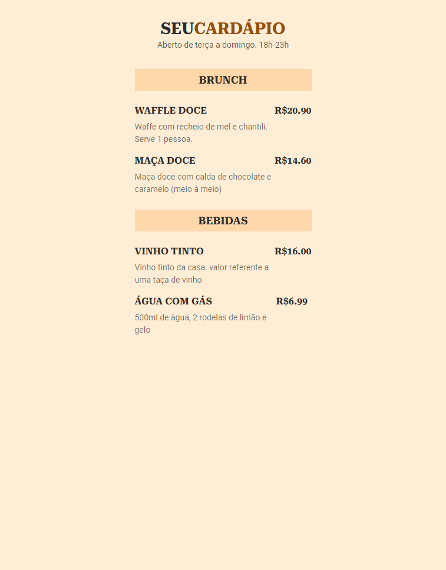

# Seu Cardápio

>Projeto 'Seu Cardápio'

O Projeto 'Seu Cardápio' Next Level Week da Rocketseat.
Um projeto onde porpfessor Mayk ensinou os primeiros passos de HTML e CSS para iniciantes.

<!-- [🔗 Clique aqui para acessar](https://luanpablocs.github.io/meus-links/) -->

## 🌐 Tecnologias 

  
 
 

## 📱 Contato

